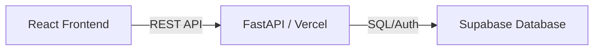

# 🚀 OVN Board - API (High-Performance Task Management)

Welcome to the **OVN Board API**! This is the engine behind my custom Kanban system. Built with **FastAPI** and **Supabase**, this backend is designed for speed, reliability, and extreme customizability.

> **"Why wait for Jira to load when you can build your own in 2 hours?"** - Me, with my AI coding assistant.

## 🌟 Why I Built This
Forget heavy, expensive, and rigid project management tools. I wanted a system that fits *my* workflow, not the other way around. This API powers a board that tracks tasks from **Backlog** to **Finished**, providing real-time timeline data and productivity insights.

- **FastAPI**: Because performance matters.
- **Supabase**: Real-time DB and Auth that just works.
- **Vercel Serverless Ready**: Deploy globally with zero server maintenance.

---

## 🏗️ Technical Architecture
This API acts as a secure bridge between the [OVN Board UI](https://github.com/dionmadyasta/ovnboard-ui) and the Supabase database. It handles task lifecycle logic, state transitions, and timestamp tracking for detailed performance analytics.



---

## ⚙️ Setup & Installation

### 1. Prerequisite
- Python 3.9+
- Supabase Account

### 2. Local Setup
```bash
# Clone the repository
git clone https://github.com/dionmadyasta/ovnboard-api.git
cd ovnboard-api

# Create and activate virtual environment
python -m venv venv
source venv/bin/activate  # On Windows: venv\Scripts\activate

# Install dependencies
pip install -r requirements.txt
```

### 3. Environment Variables
Create a `.env` file in the root directory:
```env
SUPABASE_URL=your_supabase_url_here
SUPABASE_KEY=your_supabase_anon_key_here
```

### 4. Database Setup
Copy and paste the following SQL into your **Supabase SQL Editor** to create the necessary table:

```sql
-- Create Tasks Table
CREATE TABLE tasks (
    id UUID PRIMARY KEY DEFAULT gen_random_uuid(),
    user_id UUID REFERENCES auth.users(id) ON DELETE CASCADE,
    title TEXT NOT NULL,
    description TEXT,
    due_date DATE NOT NULL,
    status TEXT NOT NULL DEFAULT 'backlog',
    created_at TIMESTAMPTZ DEFAULT NOW(),
    moved_to_progress_at TIMESTAMPTZ,
    moved_to_completed_at TIMESTAMPTZ
);

-- Enable RLS (Row Level Security)
ALTER TABLE tasks ENABLE ROW LEVEL SECURITY;

-- Policy: Users can only see/edit their own tasks
CREATE POLICY "Users can manage their own tasks" ON tasks
    FOR ALL USING (auth.uid() = user_id);
```

### 5. Running Locally
```bash
python main.py
```
The API will be available at `http://localhost:8000`. Documentation (Swagger UI) at `http://localhost:8000/docs`.

---

## ☁️ Deployment (Vercel)
This backend is structured for Vercel Serverless. To deploy:
1. Ensure `main.py` is ready and `vercel.json` (if needed) is configured.
2. Run `vercel deploy` or connect your GitHub repo.
3. Don't forget to add your `.env` variables to the Vercel Dashboard!

---

## 🤝 Connected Part
Looking for the UI? Check out the **[OVN Board UI Repo](https://github.com/dionmadyasta/ovnboard-ui)**.

Built with ⚡ and AI.
